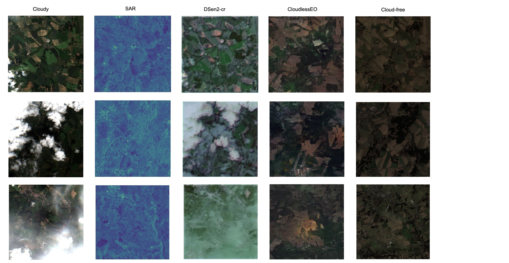

### Benchmark

We compare our neural network architecture from CloudlessEO to state-of-the-art open source cloud removal network DSen2-cr. We tested the two algorithms on the same real-life data. 

We used the official codes published by the authors of the [paper](https://doi.org/10.1016/j.isprsjprs.2020.05.013 "paper"). 

> Meraner, A., Ebel, P., Zhu, X. X., & Schmitt, M. (2020). Cloud removal in Sentinel-2 imagery using a deep residual neural network and SAR-optical data fusion. ISPRS Journal of Photogrammetry and Remote Sensing, 166, 333-346.

# Notes and Observations

- CloudlessEO outperforms the DSen2-cr model on new and unseen data.
- DSen2-cr performs poorly on high cloud cover which is expected as it bases on one single input image in an inpainting approach. Therefore it has limited input features to generate the cloud-free image.
- CloudlessEO uses time series and does not rely on one single take and therefore increases the amount of input features that can be extracted to guide the accurate generation of the cloud-free image. CloudlessEO's output images are highly accurate even with thick cloud cover.

# How to reproduce these results

We included a data example to run the inference on DSen2-cr. Use the official codes and weidghts published by the authors available at the repository: [https://github.com/ameraner/dsen2-cr](https://github.com/ameraner/dsen2-cr "https://github.com/ameraner/dsen2-cr").

For a quick run, we included a Jupyter notebook based on the exact codes of the official repository. Use it as follows:

1. Clone the official repository of DSen2-cr
`git clone https://github.com/ameraner/dsen2-cr`

2. Clone this reposiory
`git clone https://github.com/Thetaspace/comparison-cloudremoval`

1. Build the docker image
`cd dsen2-cr/Docker`
`docker build . -t dsen2-cr`

1. Run the docker container
`docker run -it -p 8888:8888 dsen2-cr`

1. After installing jupyter in the docker container and copying the example data, run (in the container) jupyter notebook using
`jupyter notebook --no-browser --port=8888 --ip=0.0.0.0`

1. Use your browser to connect to the jupyter server
`https://localhost:8888`

1. Run the scripts in example.ipynb

**P.S:** CloudlessEO is a **proprietary** software. The source codes are **NOT** published for the time being. Please contact us at [info@theta.space](mailto:info@theta.space "info@theta.space")